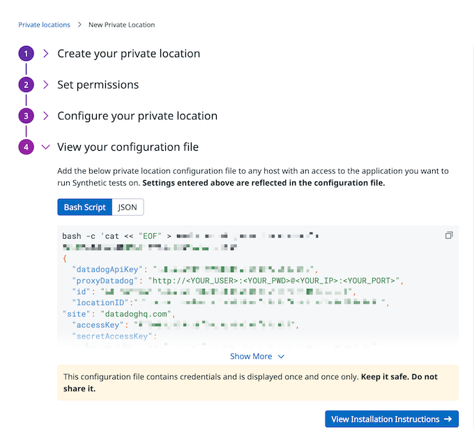

Run Synthetic Tests from Private Locations

Overview

Private locations allow you to monitor internal-facing applications or any private endpoints that aren’t accessible from the public internet.

We Configure private location by customizing the generated configuration file and this configuration file is in json format and we have stored this file in ssm parameter as it stores API key/Secret/Certificate. Now to fetch the ssm parameter inside cluster we are using secrets-store-csi-driver and mounting it to a pod for creating a secret with configuration file so DataDog agent can run with given configuration.
